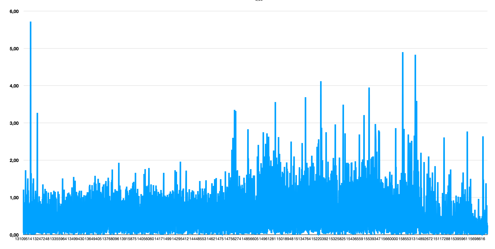

# StETH/USD and ETH/USD research

## Problem

Currently [stETH/USD](https://data.chain.link/ethereum/mainnet/crypto-usd/eth-usd) and [ETH/USD](https://data.chain.link/ethereum/mainnet/crypto-usd/eth-usd) have different deviation and heart rate to be updated (0.5% vs 1% and 30 min vs 1hr). It creates situations when the gap between two calculated values in USD could have a big gap, which comes from different update times.

This repos contains the script which collects deviations between USD prices, computed by two different ways:

- Getting data from stETH/USD chainlink oracle
- Getting data from stETH/ETH chainlink oracle and multiply it to ETH/USD price getting from proper chainlink oracle.

## Data for 9-Nov-2022

You can find data collected till block # 15912373 in [/data/data.csv](/data/data.csv)

### Deviation distribution

Historically, the biggest deviation was **5.72%**. In this table you can find distribution to estimate probability of these events.

| deviation, % | Period, blocks | % of total blocks |
|:------------:|:-------------:|:-------------:|
| 0-1 | 2636182 | 94,04215% |
| 1-2 | 157331 | 5,61257% |
| 2-3 | 9527 | 0,33986% |
| 3-4 | 122 | 0,00435% |
| 4-5 | 22 | 0,00078% |
| 5+ | 8 | 0,00029% |

## How install and run

1. Clone the repo
2. Run `yarn && yarn build` to install dependencies and type generation
3. Create `.env` file and provide mainnet RPC provider in `ETH_MAINNET_PROVIDER=` there.
4. Run `yarn compare` to collect data.

Each time you run a script, it starts from the latest save point, so only new data will be updated. If you want to change it and gather all data from scratch, you should remove `data/progress.json`.

